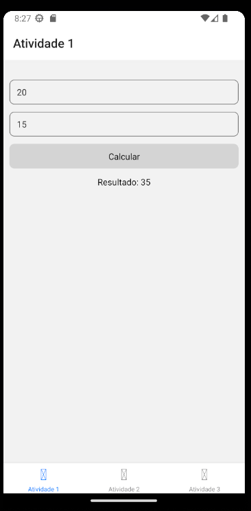
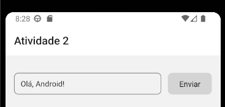
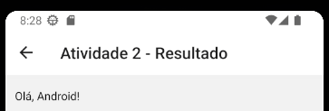
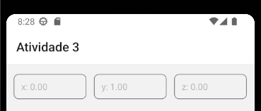
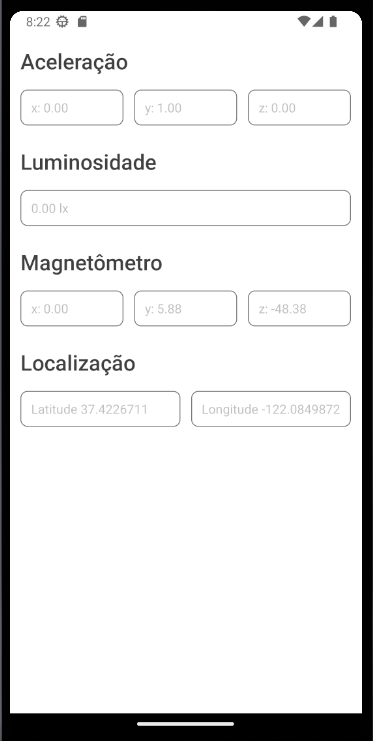

# Prática 1 - Interação Humano Computador

## Para executar o projeto

1. Clone o repositório

2. Entre na pasta do projeto

```bash
cd part1 // ou cd part2
```

3. Instale as dependências

```bash
npm install
```

4. Execute o projeto

```bash
npm start
```

## Parte 1






## Parte 2


